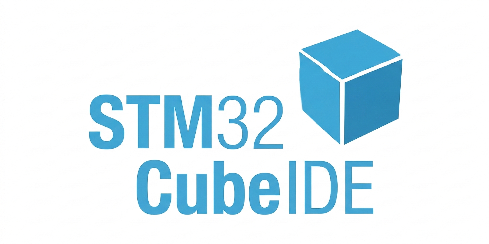
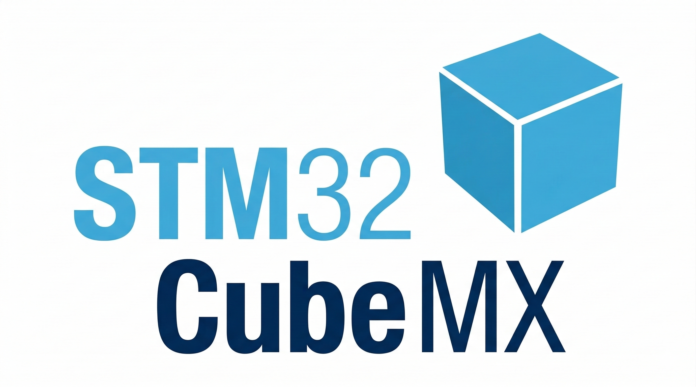

# 💃  Project 1 Stage Performance

## **1. Project Summary (프로젝트 요약)**
STM32(MCU)를 활용하여 무대 공연 장치들을 제작


## 2. Key Features (주요 기능)

- 서브모터를 통하여 무대의 배경을 전환
- 선풍기 모듈을 통하여 무대의 바람을 연출
- FND를 통해 "DAY1"같은 문구로 날짜를 표현
- 7-SEG를 통해 바람의 세기를 표현
- 버튼과 블루투스를 통하여 무대 장치를 제어


## 🛠 3.  Tech Stack (기술 스택)


### 3.1 Language (사용언어)


### 3.2 Development Environment (개발 환경)
| IDE | Configuration |
| :---: | :---: |
|  |  |
| **STM32CubeIDE** | **STM32CubeMX** |

### 3.3 Collaboration Tools (협업 도구)


## 📂 4.  Project Structure (프로젝트 구조)

### 4.1 Project Tree (프로젝트 트리)

```
Project 1 Stage Perfomance/
├── Core/
│   ├── Inc/                     # 각 소스 모듈에 대응하는 헤더 파일 (.h)
│   └── Src/                     # 프로젝트 핵심 로직 구현부 (.c)
│       ├── main.c               # 하드웨어 초기화 및 전체 시스템 제어 루프
│       ├── fan.c                # 팬(Fan) 속도 제어 및 7-SEG 출력 제어
│       ├── fnd.c                # FND 디스플레이 출력 및 문구 제어
│       ├── bt.c                 # 블루투스 통신 모듈 처리
│       ├── rotate.c             # 모터 회전 및 각도 제어 알고리즘
│       ├── button.c             # 사용자 버튼 입력 처리 (모드 전환 등)
│       ├── interrupt.c          # 시스템 인터럽트 서비스 루틴 관리
│       ├── led.c                # 시스템 상태 표시 LED 제어
│       ├── tim.c                # PWM 및 타이머 관련 설정
│       └── usart.c              # 블루투스/디버깅용 시리얼 통신 설정
│
├── images/                      # 프로젝트 시연 이미지 및 다이어그램 리소스
├── FAN_TEAM5.ioc                # STM32CubeMX 하드웨어 구성 및 핀 배치 설계도
└── README.md                    # 프로젝트 전체 가이드 문서
```


### 4.2 Hardware BlockDiagram (하드웨어 블록다이어그램)


### 4.3 FlowChart (순서도)


## 🏝️ 5. Final Product & Demonstration (완성품 및 시연)

### 5.1 Final Product (완성품)
<br>


|**무대 전체 샷 (Full Setup)** |
| :---: |
| |


| **무대 내부 (Inner)** | **무대 제어부 (Side)** | 
| :---: | :---: |
|  |   | 


<br>


### 5.2  Demonstration (시연 영상)

<a href="https://youtu.be/8-iijkoDCPc?si=8JkFLacraABops5g" target="_blank">
  
</a>

*이미지를 클릭하면 시연 영상(유튜브)로 이동합니다.*


## 6. Troubleshooting (문제 해결 기록)

<details>
<summary> <b> 서보모터 구동시 FND 출력 왜곡 문제 </b></summary>

<br>

🔍  **Issue (문제 상황)**

- FND의 출력이 서브모터가 작동중이면 제대로 **"DAY1"** 문구가 정상적으로 출력되지 않음

❓ **Analysis (원인 분석)**

- FND는 다이내믹 디스플레이(Dynamic Display) 방식으로, 4개의 자릿수를 아주 빠른 속도로 번갈아 켜서 동시에 켜진 것처럼 보이게 함(Multiplexing)
- 이것이 Polling 방식이라 서브모터의 동작과 충돌을 일으킴


❗ **Action (해결 방법)**

- __NOP() (No Operation) 인스트럭션을 활용한 tiny_delay() 함수 구현
- CPU의 시스템 클럭(Tick)보다는 길고, 모터 제어 루프에는 영향을 주지 않는 최적화된 대기 시간을 설정하여 FND 자릿수 전환 타이밍을 조정

✅ **Result (결과)**

- 서보 모터의 동작 유무와 상관없이 FND의 문구가 떨림 없이 안정적으로 출력됨.

</details>


<details>
<summary> <b> 버튼 입력 인식 불가 현상 </b></summary>

<br>

🔍  **Issue (문제 상황)**

- 서보 모터가 회전하고 있는 도중에는 사용자 버튼 입력이 감지되지 않는 불안정성 발견

❓ **Analysis (원인 분석)**

- 버튼 입력과 모터 구동 로직이 모두 메인 루프 내에서 폴링(Polling) 방식으로 동작함

- MCU가 모터의 회전을 컨트롤하는 동안 버튼 상태를 체크하는 로직이 실행되지 못해 입력 신호를 놓치는(Miss) 현상 발생

❗ **Action (해결 방법)**

- 버튼 입력 시스템을 **외부 인터럽트(External Interrupt)** 방식으로 전환
- 서브모터 로직이 수행 중이더라도 MCU가 인지하도록 변경

✅ **Result (결과)**

서브모터가 작동중이어도 버튼 데이터가 실시간으로 즉각 반영
</details>


