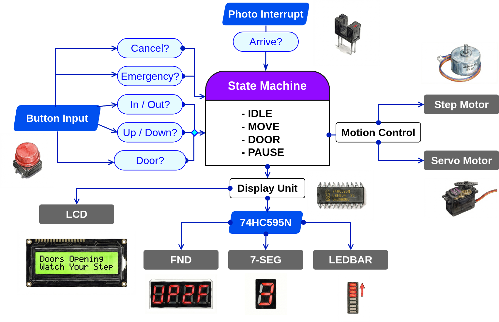
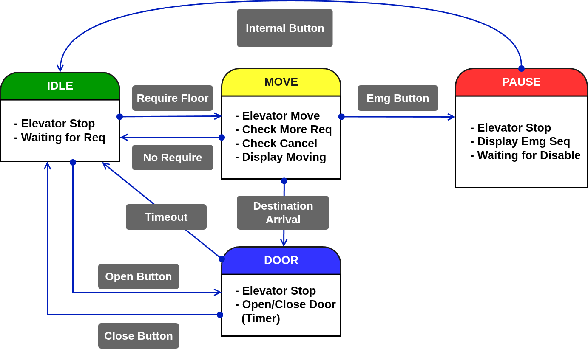

# 🛗  Project 2 Elevator

## **1. Project Summary (프로젝트 요약)**
STM32(MCU)를 활용한 상용화 가능한 수준의 엘리베이터 로직 개발


## 2. Key Features (주요 기능)

- 엘리베이터 내부/외부 버튼을 통한 실시간 층 호출
- 주행 방향과 외부 버튼의 호출 방향이 일치하면 우선 정지
- 주행 방향과 반대되는 호출은 대기 열에 저장 후, 순차적으로 도착
- 내부 버튼으로 목적지 예약 기능 및 재입력 시 예약을 해제하는 토글(Toggle) 방식의 취소 기능
- 비상정지 버튼을 누르면 비상정지 후 다시 내부버튼을 누르면 그 층으로 복귀


## 🛠 3.  Tech Stack (기술 스택)


### 3.1 Language (사용언어)


### 3.2 Development Environment (개발 환경)
| IDE | Configuration |
| :---: | :---: |
|  |  |
| **STM32CubeIDE** | **STM32CubeMX** |

### 3.3 Collaboration Tools (협업 도구)


## 📂 4.  Project Structure (프로젝트 구조)

### 4.1 Project Tree (프로젝트 트리)

```
Project 2 Elevator/
├── Core/
│   ├── Inc/                     # 각 소스 모듈에 대응하는 헤더 파일 (.h)
│   └── Src/                     # 프로젝트 핵심 로직 구현부 (.c)
│       ├── main.c               # 주변장치 초기화 및 전체 시스템 제어 루프
│       ├── elevator.c           # 엘리베이터 주행 스케줄링 및 상태 머신(FSM) 핵심 알고리즘
│       ├── stepper.c            # 스테퍼 모터를 이용한 승강기 층간 이동
│       ├── motor.c              # 도어 개폐용 서보 모터 로직
│       ├── button.c             # 내/외부 호출 버튼 입력 처리
│       ├── fnd.c & 7seg.c       # 현재 층과 이동표시를 위한 LED 제어
│       ├── i2c_lcd.c            # I2C LCD를 이용한 상태 메시지 및 안내 출력
│       ├── ledbar.c             # LED 바를 활용한 승강기 위치 시각화
│       ├── delay.c              # 시스템 타이밍 최적화를 위한 정밀 지연 함수
│       ├── tim.c                # 모터 및 디스플레이 제어를 위한 타이머 설정
│       └── stm32f4xx_it.c       # 시스템 예외 및 버튼 인터럽트 서비스 루틴
│
├── images/                      # README용 시연 이미지 및 다이어그램 리소스
├── TEAM6_Elevator_ALL.ioc       # STM32CubeMX 하드웨어 구성 및 핀 배치 설계도
└── README.md                    # 프로젝트 전체 가이드 문서
```


### 4.2 Hardware BlockDiagram (하드웨어 블록다이어그램)



### 4.3 State Machine (상태 머신)



## 🌈 5. Demonstration (시연)


<a href="https://youtube.com/playlist?list=PL6xfXHA4BYR-s5s7apoRJ_Ob76u2-pkTi&si=Q4Dn0nLA2PKm6QS-" target="_blank">
  
</a>

*이미지를 클릭하면 시연 영상(유튜브)로 이동합니다.*


## 6. Troubleshooting (문제 해결 기록)

### 6.1 블로킹 (Blocking) 


🔍  **Issue (문제 상황)**

- 스테퍼 모터(Stepper), 서보 모터(Servo), LED, CLCD, 버튼 등이 개별적으로 작동시에는 문제없음
- 동시에 구동 시 동작 간섭이 발생하여 시스템이 멈추거나 버튼 입력을 감지하지 못하는 현상 발생

❓ **Analysis (원인 분석)**


- 엘리베이터 시스템 특성상 다수의 입력 버튼이 필요했으나, STM32의 **EXTI(외부 인터럽트)** 라인 공유 문제(MUX 방식)으로 인해 모든 버튼을 인터럽트로 구성하는 데 한계가 있음
- 대부분의 출력 장치(모터, LCD)와 입력 장치(버튼)가 폴링(Polling) 방식으로 설계되어, 특정 동작이 완료될 때까지 CPU가 대기하는 블로킹(Blocking) 현상이 발생하여 멀티태스킹이 불가능함을 확인


❗ **Action (해결 방법)**

- 모든 출력과 동작을 Non-blocking으로 제작
- 버튼의 입력 감지를 최우선

✅ **Result (결과)**

- 여러 장치가 동시에 구동되는 상황에서도 병렬동작 가능

---


 ### 6.2 이중입력 (Duplicate Input)


🔍  **Issue (문제 상황)**

- 내부 층 버튼을 한 번만 눌렀음에도 2번 이상 입력된 것으로 인식되어, 토글(Toggle) 기능에 의해 목표층 예약이 즉시 취소되는 현상 발생

❓ **Analysis (원인 분석)**

- 아날로그 버튼의 물리적 특성인 **채터링(Chattering/Bouncing)** 현상으로 인해, 짧은 시간 동안 여러 번의 입력을 MCU가 감지
- 토글 로직이 이중·삼중 입력을 각각 별개의 명령으로 처리하여 예약과 취소가 순식간에 교차 발생


❗ **Action (해결 방법)**

- 입력 **래치(Latch)** 검사 로직 도입: 버튼이 눌린 직후 상태를 고정(Lock)하고, 버튼에서 손을 떼는 순간에 종료
- **Busy**상태에 진입하면 무조건 1번의 입력만 받도록 로직 설계

✅ **Result (결과)**

- 내부버튼의 토글기능이 정상적으로 잘 작동함

---


### 6.3 층 예약 (Floor Request System) 


🔍  **Issue (문제 상황)**

- 승강기 이동 중에 새로운 층을 예약하면 기존의 목표층 데이터가 소실되고, 가장 최근에 입력된 층으로 경로가 즉시 바뀌는 오류 발생

❓ **Analysis (원인 분석)**

- 목표층 정보를 저장하는 변수가 단일 구조로 설계되어 있어, 새로운 호출이 발생할 때마다 기존 데이터가 덮어씌워짐(Overwrite)


❗ **Action (해결 방법)**

- 요구받은 층을 저장하는 변수를 **Requested_floor** 란 변수를 새로 선언해서 층의 입력만 받도록함
- 모터 동작은 **Destination_floor** 이라는 변수를 만들어서 이쪽의 정보로만 움직이게 함
- 엘리베이터가 층에 도착했을때 두 변수를 비교하여 그 층에 멈춰설지 다음 층으로 이동할지 판단 시킴

✅ **Result (결과)**

- 승강기의 예약층 버튼 기능이 성공적으로 작동함

---

### 6.4 승강기의 방향 (Direction)


🔍  **Issue (문제 상황)**

- 외부 엘리베이터 버튼은 상/하 방향을 포함하고 있음
- 엘리베이터 동작 방향에 맞게 층을 무시하거나 멈춰야하는데 무조건적으로 멈춤

❓ **Analysis (원인 분석)**

- 승강기의 현재 주행 상태와 외부 호출의 방향성을 대조하는 판단 변수가 없어서 위치 기반으로만 정지함


❗ **Action (해결 방법)**

- **out_req_up** , **out_req_down** 변수를 선언하여 외부에서 입력한 방향이 어디인지 저장
- 승강기의 진행 방향과 외부 호출 방향이 일치할 때만 정지하고, 반대 방향일 경우 해당 호출을 무시하고 지나친 뒤 동작 완료 후 복귀하여 처리

✅ **Result (결과)**

- 외부버튼의 방향에 따라 승강기가 우선순위를 정해 층을 찾아가는 효율적인 우선순위 알고리즘 구현


